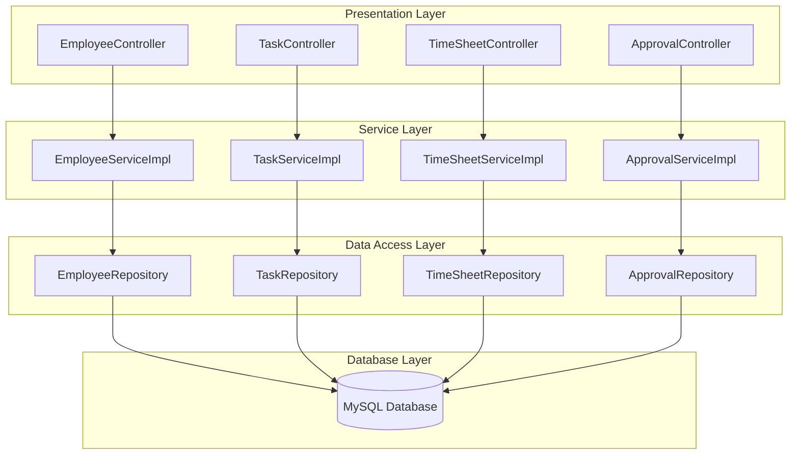

# [TIMESHEET MANAGEMENT]

**Course:** CS425 - Software Engineering 
**Block:** August 2025  
**Professor:** Obinna Kalu  

**Team Members:**  
- [Thanh Hai Nguyen] - [619562]  
- [Adisalem Hadush Shiferaw] - [619567]  

**Date of Submission:** [08/14/2025]  

---

## 1. Problem Description

The Timesheet Management System is designed to address the need for efficient, accurate, and user-friendly tracking of employee work hours within a current-week-only scope. It enables employees to create tasks linked to predefined projects, log daily work hours, and submit weekly timesheets for managerial approval. Managers can view, approve, or reject submissions from their direct reports, ensuring accountability and oversight. The system enforces critical business rules such as role-based access, daily hour limits, and real-time total calculations, streamlining the approval workflow and laying a scalable foundation for future enhancements like historical tracking, advanced reporting, and cross-team functionality.

---

## 2. User Stories

Describe the system from the user's perspective using user stories:

- As an **[Employee]**, I want to **[create a task]** for a given week so that my work hours are recorded and can be approved by my manager
- As an **[Employee]**, I want to **[edit my task]** edit my timesheet before it is approved so that I can correct any mistakes.
- As a **[Manager]**, I want to **[approve or reject]** submitted tasks so that only valid work hours are recorded.
- As a **[Manager]**, I want to  **[view all timesheets]** submitted by my team so that I can monitor their work hours.


---

## 3. Functional Requirements

List the system's essential features and functionalities:

- Employees can create timesheet.
- Employees can create weekly tasks
- Employees able to view their task.
- Managers able to view all timesheets submitted by their team.
- Managers able to approve or reject submitted timesheets.
- The system must record the approval status and comments for each timesheet.
---

## 4.  Non-Functional Requirements

- **Maintainability:**
  - The codebase should follow clean code principles and be well-documented.
  - The system should be modular, allowing for easy updates and bug fixes.

- **Usability:**
  - The user interface should be intuitive and easy to navigate for all user roles.
  - The system should provide clear feedback for user actions (e.g., successful submission, errors).

---

## 5. Architecture of Project

### 5.1 Overview

Our system follows a **4-layer N-tier architecture** using modern Java Spring Boot practices:

1. **Presentation Layer (Controller)**  
   - Exposes RESTful APIs for all business entities (Employee, Department, Project, Task, Timesheet, Approval, etc.).
   - Handles HTTP requests and responses, input validation, and error handling.
   - Example: `EmployeeController`, `TaskController`, etc.

2. **Service Layer**  
   - Contains business logic and orchestrates data flow between controllers and repositories.
   - Handles validation, calculations (e.g., total work hours), and business rules.
   - Example: `EmployeeServiceImpl`, `TaskServiceImpl`, etc.

3. **Data Access Layer (Repository/DAO)**  
   - Uses Spring Data JPA repositories to abstract and manage all database operations.
   - Provides CRUD and custom query methods for each entity.
   - Example: `EmployeeRepository`, `TaskRepository`, etc.

4. **Database Layer**  
   - MySQL database stores all persistent data, including employees, timesheets, tasks, approvals, and more.
   - Enforces referential integrity and supports transactional operations.

This separation ensures modularity, testability, and maintainability.

---

### 5.2 Architecture Diagram



---

### 5.3 Technologies Used


- Language: [Java, JavaScript]  
- Framework: [Spring Boot, React, JUnit]  
- Database: [MySQL]  
- Tools: [Git, GitHub, Postman]  

---

### 5.4 Layer Descriptions

- **Presentation Layer:**  
  - Exposes REST APIs to clients (frontend or Postman).
  - Handles HTTP requests, input validation, and error responses.

- **Service Layer:**  
  - Implements business logic, validation, and calculations.
  - Coordinates between controllers and repositories.

- **Data Access Layer:**  
  - Uses Spring Data JPA for database CRUD operations.
  - Abstracts SQL and database details from the rest of the app.

- **Database Layer:**  
  - MySQL database with tables for Employee, Department, Project, Task, Timesheet, Approval, etc.
  - Enforces relationships and data integrity.

---

## 6. Use Case Diagram(s)  


---

## 7. Use Case Descriptions  

### Use Case Name: Submit Timesheet  
- **Primary Actor(s)**: Employee  
- **Preconditions**: User must be logged in and assigned to a project  
- **Postconditions**: A timesheet is recorded in the system  
- **Main Success Scenario**:  
  1. Employee logs in  
  2. Navigates to “Submit Timesheet”  
  3. Inputs working hours for each day  
  4. Submits the form  
  5. System stores the entry and displays confirmation  

---

## 8. Class Diagram

```mermaid
classDiagram
    %% Core Entity Classes
    class Employee {
        -Integer employeeId
        -String firstName
        -String lastName
        -String email
        -String position
        -LocalDateTime createdAt
        -LocalDateTime updatedAt
        +getEmployeeId()
        +setEmployeeId()
        +getFirstName()
        +setFirstName()
        +getLastName()
        +setLastName()
        +getEmail()
        +setEmail()
        +getPosition()
        +setPosition()
        +getDepartment()
        +setDepartment()
        +getManager()
        +setManager()
    }

    class Department {
        -Integer departmentId
        -String name
        -LocalDateTime createdAt
        -LocalDateTime updatedAt
        +getDepartmentId()
        +setDepartmentId()
        +getName()
        +setName()
        +getHeadEmployee()
        +setHeadEmployee()
    }

    class Project {
        -Integer projectId
        -String name
        -String description
        -LocalDate startDate
        -LocalDate endDate
        -ProjectStatus status
        -LocalDateTime createdAt
        -LocalDateTime updatedAt
        +getProjectId()
        +setProjectId()
        +getName()
        +setName()
        +getDescription()
        +setDescription()
        +getStartDate()
        +setStartDate()
        +getEndDate()
        +setEndDate()
        +getStatus()
        +setStatus()
        +getClient()
        +setClient()
        +getProjectManager()
        +setProjectManager()
    }

    class Client {
        -Integer clientId
        -String clientName
        -String contactEmail
        -String contactPhone
        -String address
        -LocalDateTime createdAt
        -LocalDateTime updatedAt
        +getClientId()
        +setClientId()
        +getClientName()
        +setClientName()
        +getContactEmail()
        +setContactEmail()
        +getContactPhone()
        +setContactPhone()
        +getAddress()
        +setAddress()
    }

    class TimeSheet {
        -Integer timesheetId
        -LocalDate periodStartDate
        -LocalDate periodEndDate
        -TimeSheetStatus status
        -LocalDateTime submissionDate
        -BigDecimal totalHours
        -LocalDateTime createdAt
        -LocalDateTime updatedAt
        +getTimesheetId()
        +setTimesheetId()
        +getEmployee()
        +setEmployee()
        +getPeriodStartDate()
        +setPeriodStartDate()
        +getPeriodEndDate()
        +setPeriodEndDate()
        +getStatus()
        +setStatus()
        +getTotalHours()
        +setTotalHours()
    }

    class TimeSheetEntry {
        -Integer entryId
        -LocalDate date
        -BigDecimal hoursWorked
        -String taskDescription
        -LocalDateTime createdAt
        -LocalDateTime updatedAt
        +getEntryId()
        +setEntryId()
        +getDate()
        +setDate()
        +getHoursWorked()
        +setHoursWorked()
        +getTaskDescription()
        +setTaskDescription()
        +getProject()
        +setProject()
        +getTimeSheet()
        +setTimeSheet()
    }

    class Approval {
        -Integer approvalId
        -ApprovalStatus status
        -LocalDateTime approvedAt
        -String comments
        -LocalDateTime createdAt
        -LocalDateTime updatedAt
        +getApprovalId()
        +setApprovalId()
        +getStatus()
        +setStatus()
        +getApprovedAt()
        +setApprovedAt()
        +getComments()
        +setComments()
        +getApprovedBy()
        +setApprovedBy()
        +getTimeSheet()
        +setTimeSheet()
    }

    class User {
        -Integer userId
        -String userName
        -String password
        -Boolean isActive
        -LocalDateTime lastLogin
        -LocalDateTime createdAt
        -LocalDateTime updatedAt
        +getUserId()
        +setUserId()
        +getUserName()
        +setUserName()
        +getPassword()
        +setPassword()
        +getEmployee()
        +setEmployee()
        +getIsActive()
        +setIsActive()
        +getAuthorities()
        +isAccountNonExpired()
        +isAccountNonLocked()
        +isCredentialsNonExpired()
        +isEnabled()
    }

    class Role {
        -Integer roleId
        -String roleName
        -String description
        -String permissions
        -LocalDateTime createdAt
        -LocalDateTime updatedAt
        +getRoleId()
        +setRoleId()
        +getRoleName()
        +setRoleName()
        +getDescription()
        +setDescription()
        +getPermissions()
        +setPermissions()
    }

    class UserRole {
        -Integer userRoleId
        -LocalDate assignedDate
        -LocalDateTime createdAt
        -LocalDateTime updatedAt
        +getUserRoleId()
        +setUserRoleId()
        +getAssignedDate()
        +setAssignedDate()
        +getUser()
        +setUser()
        +getRole()
        +setRole()
    }

    class EmployeeProject {
        -Integer employeeProjectId
        -LocalDate assignedDate
        -Boolean isActive
        -String roleInProject
        -LocalDateTime createdAt
        -LocalDateTime updatedAt
        +getEmployeeProjectId()
        +setEmployeeProjectId()
        +getAssignedDate()
        +setAssignedDate()
        +getIsActive()
        +setIsActive()
        +getRoleInProject()
        +setRoleInProject()
        +getEmployee()
        +setEmployee()
        +getProject()
        +setProject()
    }

    %% Enums
    class ProjectStatus {
        <<enumeration>>
        PLANNING
        ACTIVE
        COMPLETED
        CANCELLED
    }

    class TimeSheetStatus {
        <<enumeration>>
        DRAFT
        SUBMITTED
        APPROVED
        REJECTED
    }

    class ApprovalStatus {
        <<enumeration>>
        PENDING
        APPROVED
        REJECTED
    }

    %% Relationships
    Employee ||--o{ Employee : "manager"
    Employee ||--o{ TimeSheet : "creates"
    Employee ||--o{ Approval : "approves"
    Employee ||--o{ User : "has"
    Employee ||--o{ EmployeeProject : "assigned to"
    Employee ||--o{ Project : "manages"
    Employee ||--o{ Department : "heads"

    Department ||--o{ Employee : "contains"
    Department ||--o{ Employee : "headed by"

    Project ||--o{ TimeSheetEntry : "has entries"
    Project ||--o{ EmployeeProject : "assigned employees"
    Project ||--o{ Employee : "managed by"
    Project ||--o{ Client : "belongs to"

    Client ||--o{ Project : "owns"

    TimeSheet ||--o{ TimeSheetEntry : "contains"
    TimeSheet ||--o{ Approval : "has"
    TimeSheet ||--o{ Employee : "belongs to"

    User ||--o{ UserRole : "has"
    User ||--o{ Employee : "represents"

    Role ||--o{ UserRole : "assigned to"

    %% Enums
    Project ||--|| ProjectStatus : "has"
    TimeSheet ||--|| TimeSheetStatus : "has"
    Approval ||--|| ApprovalStatus : "has"
```

### 8.1 Class Diagram Description

The class diagram represents the complete data model of the TimeSheet Management System with the following key components:

#### **Core Entity Classes:**
- **Employee**: Represents system users with personal information and organizational relationships
- **Department**: Organizational units that contain employees
- **Project**: Work initiatives managed by employees and owned by clients
- **Client**: External organizations that own projects
- **TimeSheet**: Weekly work hour records submitted by employees
- **TimeSheetEntry**: Individual daily work entries within a timesheet
- **Approval**: Managerial review records for timesheet submissions
- **User**: Authentication and authorization entities linked to employees
- **Role**: System roles defining user permissions
- **UserRole**: Many-to-many relationship between users and roles
- **EmployeeProject**: Many-to-many relationship between employees and projects

#### **Key Relationships:**
- **Employee Hierarchy**: Self-referencing relationship for manager-subordinate structure
- **Organizational Structure**: Department contains employees, with one employee as department head
- **Project Management**: Projects belong to clients and are managed by employees
- **Timesheet Workflow**: Employees create timesheets with entries, which go through approval process
- **User Authentication**: Users are linked to employees and have assigned roles
- **Project Assignment**: Employees can be assigned to multiple projects with specific roles

#### **Enumerations:**
- **ProjectStatus**: Tracks project lifecycle (PLANNING, ACTIVE, COMPLETED, CANCELLED)
- **TimeSheetStatus**: Tracks timesheet workflow (DRAFT, SUBMITTED, APPROVED, REJECTED)
- **ApprovalStatus**: Tracks approval decisions (PENDING, APPROVED, REJECTED)

This design supports the complete timesheet management workflow from employee time tracking to managerial approval, with proper role-based access control and organizational structure management.

---

