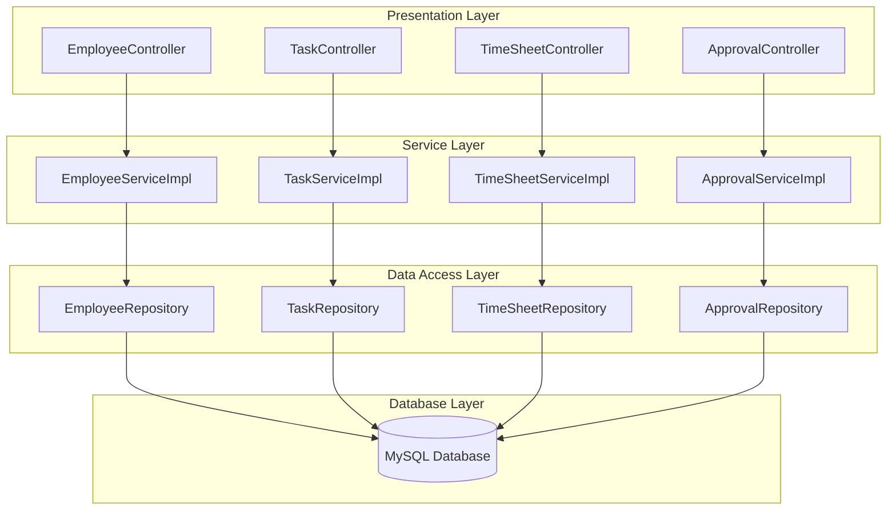
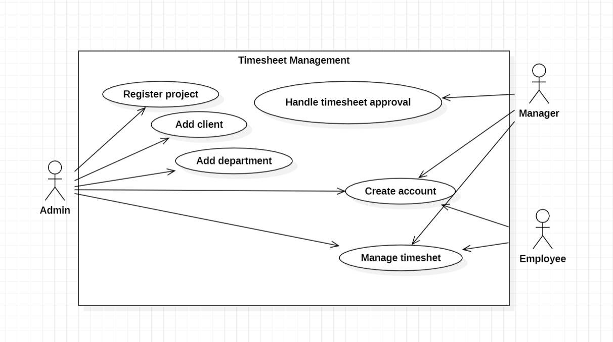
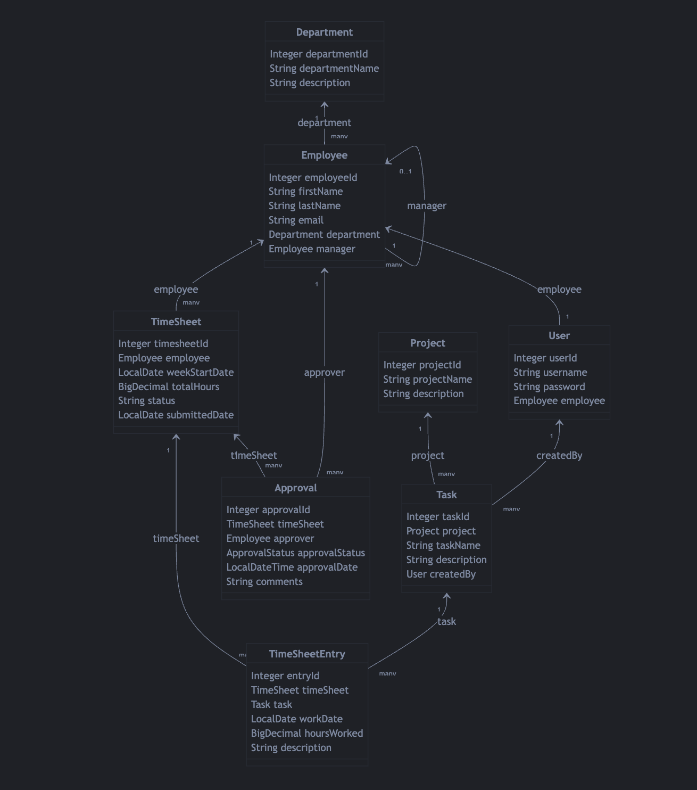
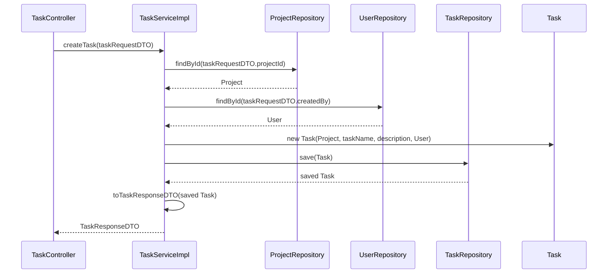
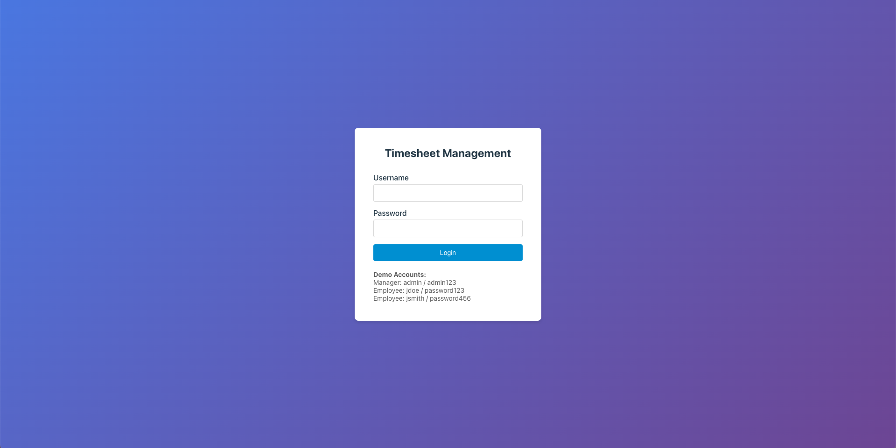
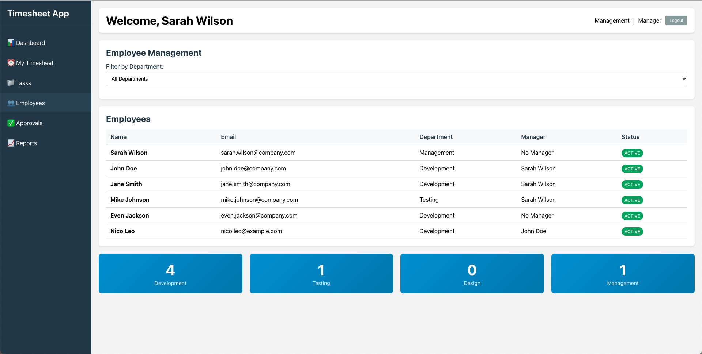
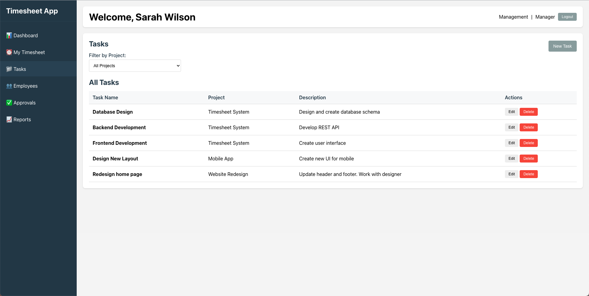
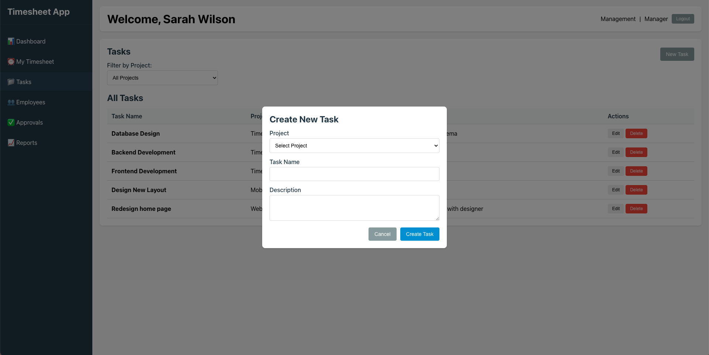
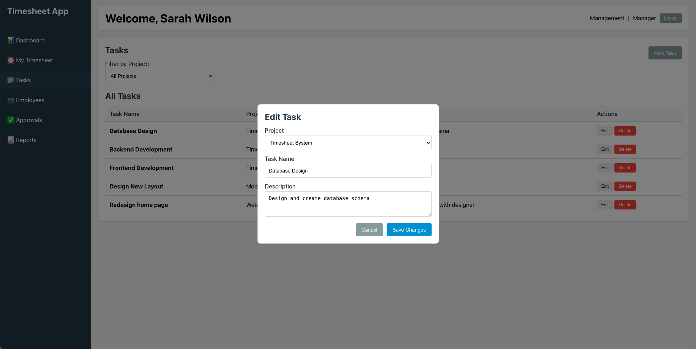

# [TIMESHEET MANAGEMENT]

**Course:** Modern Programming Practices  
**Block:** July 2025  
**Instructor:** Dr. Bright Gee Varghese R  

**Team Members:**  
- [Thanh Hai Nguyen] - [619562]  
- [Adisalem Hadush Shiferaw] - [619567]  

**Date of Submission:** [07/17/2025]  

---

## 1. Problem Description

Provide a clear and concise explanation of the real-world problem your project aims to solve.  
Include background, motivation, and significance of the problem.

---

## 2. User Stories

Describe the system from the user's perspective using user stories:

- As an **[Employee]**, I want to **[create a task]** for a given week so that my work hours are recorded and can be approved by my manager
- As an **[Employee]**, I want to **[edit my task]** edit my timesheet before it is approved so that I can correct any mistakes.
- As a **[Manager]**, I want to **[approve or reject]** submitted tasks so that only valid work hours are recorded.
- As a **[Manager]**, I want to  **[view all timesheets]** submitted by my team so that I can monitor their work hours.


---

## 3. Functional Requirements

List the system's essential features and functionalities:

- Employees can create timesheet.
- Employees can create weekly tasks
- Employees able to view their task.
- Managers able to view all timesheets submitted by their team.
- Managers able to approve or reject submitted timesheets.
- The system must record the approval status and comments for each timesheet.
---

## 4.  Non-Functional Requirements

- **Maintainability:**
  - The codebase should follow clean code principles and be well-documented.
  - The system should be modular, allowing for easy updates and bug fixes.

- **Usability:**
  - The user interface should be intuitive and easy to navigate for all user roles.
  - The system should provide clear feedback for user actions (e.g., successful submission, errors).

---

## 5. Architecture of Project

### 5.1 Overview

Our system follows a **4-layer N-tier architecture** using modern Java Spring Boot practices:

1. **Presentation Layer (Controller)**  
   - Exposes RESTful APIs for all business entities (Employee, Department, Project, Task, Timesheet, Approval, etc.).
   - Handles HTTP requests and responses, input validation, and error handling.
   - Example: `EmployeeController`, `TaskController`, etc.

2. **Service Layer**  
   - Contains business logic and orchestrates data flow between controllers and repositories.
   - Handles validation, calculations (e.g., total work hours), and business rules.
   - Example: `EmployeeServiceImpl`, `TaskServiceImpl`, etc.

3. **Data Access Layer (Repository/DAO)**  
   - Uses Spring Data JPA repositories to abstract and manage all database operations.
   - Provides CRUD and custom query methods for each entity.
   - Example: `EmployeeRepository`, `TaskRepository`, etc.

4. **Database Layer**  
   - MySQL database stores all persistent data, including employees, timesheets, tasks, approvals, and more.
   - Enforces referential integrity and supports transactional operations.

This separation ensures modularity, testability, and maintainability.

---

### 5.2 Architecture Diagram



---

### 5.3 Technologies Used


- Language: [Java, JavaScript]  
- Framework: [Spring Boot, React, JUnit]  
- Database: [MySQL]  
- Tools: [Git, GitHub, Postman]  

---

### 5.4 Layer Descriptions

- **Presentation Layer:**  
  - Exposes REST APIs to clients (frontend or Postman).
  - Handles HTTP requests, input validation, and error responses.

- **Service Layer:**  
  - Implements business logic, validation, and calculations.
  - Coordinates between controllers and repositories.

- **Data Access Layer:**  
  - Uses Spring Data JPA for database CRUD operations.
  - Abstracts SQL and database details from the rest of the app.

- **Database Layer:**  
  - MySQL database with tables for Employee, Department, Project, Task, Timesheet, Approval, etc.
  - Enforces relationships and data integrity.

---

## 6. Use Case Diagram(s)  


---

## 7. Use Case Descriptions  

### Use Case Name: Submit Timesheet  
- **Primary Actor(s)**: Employee  
- **Preconditions**: User must be logged in and assigned to a project  
- **Postconditions**: A timesheet is recorded in the system  
- **Main Success Scenario**:  
  1. Employee logs in  
  2. Navigates to “Submit Timesheet”  
  3. Inputs working hours for each day  
  4. Submits the form  
  5. System stores the entry and displays confirmation  

---

## 8. Class Diagram



---

## 9. Sequence Diagrams  

### Feature: Create a new Task  



---

## 10. Screenshots  

- **Login Page**  
  

- **Employees Page**  
  

- **Task Page**  
  

- **Create new task**  
  

- **Edit task**  
  

---

## 11. Installation & Deployment

### Step 1: Create the Database

Create the MySQL database using the provided SQL script (adjust the script as needed for your environment):

```sql
-- MySQL Timesheet Management Database Script
-- Ensure database exists and use it
CREATE DATABASE IF NOT EXISTS timesheet_management;
USE timesheet_management;

-- Drop tables if they exist (for clean recreation)
DROP TABLE IF EXISTS Approval;
DROP TABLE IF EXISTS Timesheet_Entry;
DROP TABLE IF EXISTS Timesheet;
DROP TABLE IF EXISTS Task;
DROP TABLE IF EXISTS Project;
DROP TABLE IF EXISTS Employee;
DROP TABLE IF EXISTS Department;
DROP TABLE IF EXISTS Users;

-- Create Department table
CREATE TABLE Department (
    department_id INT AUTO_INCREMENT PRIMARY KEY,
    department_name VARCHAR(50) NOT NULL UNIQUE,
    description TEXT
);

-- Create Employee table
CREATE TABLE Employee (
    employee_id INT AUTO_INCREMENT PRIMARY KEY,
    first_name VARCHAR(50) NOT NULL,
    last_name VARCHAR(50) NOT NULL,
    email VARCHAR(100) NOT NULL UNIQUE,
    department_id INT,
    manager_id INT,
    FOREIGN KEY (department_id) REFERENCES Department(department_id),
    FOREIGN KEY (manager_id) REFERENCES Employee(employee_id)
);

-- Create Project table
CREATE TABLE Project (
    project_id INT AUTO_INCREMENT PRIMARY KEY,
    project_name VARCHAR(100) NOT NULL,
    description TEXT
);

-- Create Users table (moved before Task table to resolve foreign key dependency)
CREATE TABLE Users (
    user_id INT AUTO_INCREMENT PRIMARY KEY,
    username VARCHAR(50) NOT NULL UNIQUE,
    password VARCHAR(255) NOT NULL,
    employee_id INT NOT NULL UNIQUE,
    FOREIGN KEY (employee_id) REFERENCES Employee(employee_id)
);

-- Create Task table
CREATE TABLE Task (
    task_id INT AUTO_INCREMENT PRIMARY KEY,
    project_id INT NOT NULL,
    task_name VARCHAR(100) NOT NULL,
    description TEXT,
    created_by INT,
    FOREIGN KEY (project_id) REFERENCES Project(project_id),
    FOREIGN KEY (created_by) REFERENCES Users(user_id)
);

-- Create Timesheet table
CREATE TABLE Timesheet (
    timesheet_id INT AUTO_INCREMENT PRIMARY KEY,
    employee_id INT NOT NULL,
    week_start_date DATE NOT NULL,
    total_hours DECIMAL(5,2) DEFAULT 0.00,
    status VARCHAR(20) DEFAULT 'DRAFT',
    submitted_date DATE,
    FOREIGN KEY (employee_id) REFERENCES Employee(employee_id)
);

-- Create Timesheet_Entry table
CREATE TABLE Timesheet_Entry (
    entry_id INT AUTO_INCREMENT PRIMARY KEY,
    timesheet_id INT NOT NULL,
    task_id INT NOT NULL,
    work_date DATE NOT NULL,
    hours_worked DECIMAL(4,2) NOT NULL,
    description TEXT,
    FOREIGN KEY (timesheet_id) REFERENCES Timesheet(timesheet_id),
    FOREIGN KEY (task_id) REFERENCES Task(task_id)
);

-- Create Approval table
CREATE TABLE Approval (
    approval_id INT AUTO_INCREMENT PRIMARY KEY,
    timesheet_id INT NOT NULL,
    approver_id INT NOT NULL,
    approval_status VARCHAR(20) DEFAULT 'PENDING',
    approval_date TIMESTAMP NULL,
    comments TEXT,
    FOREIGN KEY (timesheet_id) REFERENCES Timesheet(timesheet_id),
    FOREIGN KEY (approver_id) REFERENCES Employee(employee_id)
);

-- Insert sample data

-- Sample Departments
INSERT INTO Department (department_name, description) VALUES
('Development', 'Software development team'),
('Testing', 'Quality assurance and testing team'),
('Design', 'UI/UX design team'),
('Management', 'Project and team management');

-- Sample Employees
INSERT INTO Employee (first_name, last_name, email, department_id, manager_id) VALUES
('Sarah', 'Wilson', 'sarah.wilson@company.com', 4, NULL), -- CEO (no manager)
('John', 'Doe', 'john.doe@company.com', 1, 1), -- Developer (manager: Sarah)
('Jane', 'Smith', 'jane.smith@company.com', 1, 1), -- Developer (manager: Sarah)
('Mike', 'Johnson', 'mike.johnson@company.com', 2, 1); -- Tester (manager: Sarah)

-- Sample Users
INSERT INTO Users (username, password, employee_id) VALUES
('admin', 'admin123', 1), -- Sarah Wilson
('jdoe', 'password123', 2), -- John Doe
('jsmith', 'password456', 3), -- Jane Smith
('mjohnson', 'password789', 4); -- Mike Johnson

-- Sample Projects
INSERT INTO Project (project_name, description) VALUES
('Timesheet System', 'Employee timesheet management application'),
('Mobile App', 'Company mobile application development'),
('Website Redesign', 'Corporate website redesign project');

-- Sample Tasks
INSERT INTO Task (project_id, task_name, description, created_by) VALUES
(1, 'Database Design', 'Design and create database schema', 1),
(1, 'Backend Development', 'Develop REST API', 1),
(1, 'Frontend Development', 'Create user interface', 1),
(2, 'UI Design', 'Design mobile app interface', 2),
(2, 'iOS Development', 'Develop iOS application', 2),
(3, 'Homepage Design', 'Design new homepage layout', 3);

-- Sample Timesheets
INSERT INTO Timesheet (employee_id, week_start_date, total_hours, status) VALUES
(2, '2025-07-07', 40.00, 'SUBMITTED'), -- John's timesheet
(3, '2025-07-07', 38.50, 'DRAFT'),     -- Jane's timesheet
(4, '2025-07-07', 35.00, 'SUBMITTED'); -- Mike's timesheet

-- Sample Timesheet Entries
INSERT INTO Timesheet_Entry (timesheet_id, task_id, work_date, hours_worked, description) VALUES
(1, 1, '2025-07-07', 8.00, 'Created database schema and ER diagram'),
(1, 2, '2025-07-08', 8.00, 'Implemented Employee and Project APIs'),
(1, 2, '2025-07-09', 8.00, 'Implemented Timesheet APIs'),
(1, 3, '2025-07-10', 8.00, 'Created login and dashboard pages'),
(1, 3, '2025-07-11', 8.00, 'Implemented timesheet entry forms'),
(2, 4, '2025-07-07', 6.50, 'Designed mobile app wireframes'),
(2, 5, '2025-07-08', 8.00, 'Started iOS development setup'),
(3, 6, '2025-07-07', 7.00, 'Homepage mockup design');

-- Sample Approvals
INSERT INTO Approval (timesheet_id, approver_id, approval_status, approval_date, comments) VALUES
(1, 1, 'APPROVED', '2025-07-12 09:30:00', 'Good work on the database design'),
(3, 1, 'PENDING', NULL, NULL); -- Mike's timesheet pending approval
```

### Step 2: Clone the Repositories

**Backend:**
```bash
git clone https://github.com/nguyenhaia8/timesheet_management.git
cd timesheet_management
```

**Frontend:**
```bash
git clone [your-frontend-repo-url]
cd [your-frontend-folder]
```

### Step 3: Configure the Database Connection

Edit the backend configuration file at `src/main/resources/application.properties`:

```properties
spring.datasource.url=jdbc:mysql://localhost:3306/timesheet_management
spring.datasource.username=YOUR_DB_USERNAME
spring.datasource.password=YOUR_DB_PASSWORD
```

Replace `YOUR_DB_USERNAME` and `YOUR_DB_PASSWORD` with your actual MySQL credentials.

### Step 4: Run the Applications

**Backend (Spring Boot):**
```bash
mvn clean compile
mvn spring-boot:run
```
The backend will start on [http://localhost:8080](http://localhost:8080) by default.

**Frontend (React or other):**
```bash
# If using npm
npm install
npm start

# Or if using yarn
yarn install
yarn start
```
The frontend will typically start on [http://localhost:3000](http://localhost:3000) by default.

---

### Additional Notes

- Ensure MySQL is running before starting the backend.
- You may need to adjust CORS settings in the backend if accessing from a different frontend port.
- For production deployment, configure environment variables and secure credentials appropriately.

