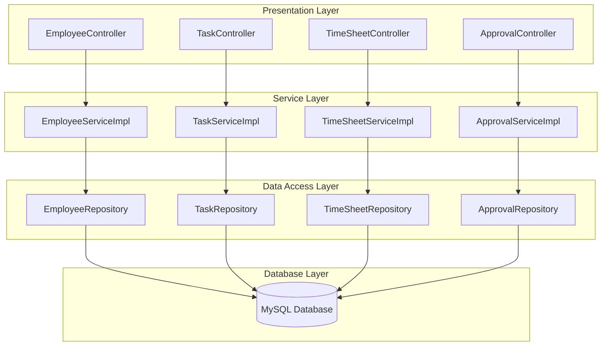

# [TIMESHEET MANAGEMENT]

**Course:** CS425 - Software Engineering 
**Block:** August 2025  
**Professor:** Obinna Kalu  

**Team Members:**  
- [Thanh Hai Nguyen] - [619562]  
- [Adisalem Hadush Shiferaw] - [619567]  

**Date of Submission:** [08/14/2025]  

---

## 1. Problem Description

The Timesheet Management System is designed to address the need for efficient, accurate, and user-friendly tracking of employee work hours within a current-week-only scope. It enables employees to create tasks linked to predefined projects, log daily work hours, and submit weekly timesheets for managerial approval. Managers can view, approve, or reject submissions from their direct reports, ensuring accountability and oversight. The system enforces critical business rules such as role-based access, daily hour limits, and real-time total calculations, streamlining the approval workflow and laying a scalable foundation for future enhancements like historical tracking, advanced reporting, and cross-team functionality.

---

## 2. User Stories

Describe the system from the user's perspective using user stories:

- As an **[Employee]**, I want to **[create a task]** for a given week so that my work hours are recorded and can be approved by my manager
- As an **[Employee]**, I want to **[edit my task]** edit my timesheet before it is approved so that I can correct any mistakes.
- As a **[Manager]**, I want to **[approve or reject]** submitted tasks so that only valid work hours are recorded.
- As a **[Manager]**, I want to  **[view all timesheets]** submitted by my team so that I can monitor their work hours.


---

## 3. Functional Requirements

List the system's essential features and functionalities:

- Employees can create timesheet.
- Employees can create weekly tasks
- Employees able to view their task.
- Managers able to view all timesheets submitted by their team.
- Managers able to approve or reject submitted timesheets.
- The system must record the approval status and comments for each timesheet.
---

## 4.  Non-Functional Requirements

- **Maintainability:**
  - The codebase should follow clean code principles and be well-documented.
  - The system should be modular, allowing for easy updates and bug fixes.

- **Usability:**
  - The user interface should be intuitive and easy to navigate for all user roles.
  - The system should provide clear feedback for user actions (e.g., successful submission, errors).

---

## 5. Architecture of Project

### 5.1 Overview

Our system follows a **4-layer N-tier architecture** using modern Java Spring Boot practices:

1. **Presentation Layer (Controller)**  
   - Exposes RESTful APIs for all business entities (Employee, Department, Project, Task, Timesheet, Approval, etc.).
   - Handles HTTP requests and responses, input validation, and error handling.
   - Example: `EmployeeController`, `TaskController`, etc.

2. **Service Layer**  
   - Contains business logic and orchestrates data flow between controllers and repositories.
   - Handles validation, calculations (e.g., total work hours), and business rules.
   - Example: `EmployeeServiceImpl`, `TaskServiceImpl`, etc.

3. **Data Access Layer (Repository/DAO)**  
   - Uses Spring Data JPA repositories to abstract and manage all database operations.
   - Provides CRUD and custom query methods for each entity.
   - Example: `EmployeeRepository`, `TaskRepository`, etc.

4. **Database Layer**  
   - MySQL database stores all persistent data, including employees, timesheets, tasks, approvals, and more.
   - Enforces referential integrity and supports transactional operations.

This separation ensures modularity, testability, and maintainability.

---

### 5.2 Architecture Diagram



---

### 5.3 Technologies Used


- Language: [Java, JavaScript]  
- Framework: [Spring Boot, React, JUnit]  
- Database: [MySQL]  
- Tools: [Git, GitHub, Postman]  

---

### 5.4 Layer Descriptions

#### **🎯 Presentation Layer (Controllers)**
- **RESTful API Controllers**: 10 controllers handling HTTP requests and responses
  - `TimeSheetController` - Manages timesheet CRUD operations with role-based access
  - `TimeSheetEntryController` - Handles individual time entries within timesheets
  - `ApprovalController` - Manages approval workflow for timesheets
  - `EmployeeController` - Employee management operations
  - `DepartmentController` - Department CRUD operations
  - `ProjectController` - Project management functionality
  - `ClientController` - Client relationship management
  - `AuthController` - Authentication and authorization endpoints
  - `UserController` - User management operations
  - `GlobalExceptionHandler` - Centralized error handling and response formatting

- **Key Features**:
  - Role-based access control with `@PreAuthorize` annotations
  - Cross-origin resource sharing (CORS) configuration
  - Input validation and error handling
  - HTTP status code management
  - DTO-based request/response handling

#### **⚙️ Service Layer (Business Logic)**
- **Service Interfaces & Implementations**: 8 service modules with business logic
  - `TimeSheetService` - Timesheet business operations and validation
  - `TimeSheetEntryService` - Time entry calculations and rules
  - `ApprovalService` - Approval workflow logic
  - `EmployeeService` - Employee business operations
  - `DepartmentService` - Department management logic
  - `ProjectService` - Project lifecycle management
  - `ClientService` - Client relationship business logic
  - `UserService` - User authentication and management

- **Key Features**:
  - Business rule enforcement (e.g., daily hour limits, approval workflows)
  - Data transformation between DTOs and entities
  - Transaction management
  - Validation logic
  - Complex calculations (e.g., total work hours, period summaries)

#### **🗄️ Data Access Layer (Repositories)**
- **Spring Data JPA Repositories**: 11 repository interfaces for database operations
  - `TimeSheetRepository` - Timesheet CRUD with custom queries
  - `TimeSheetEntryRepository` - Time entry database operations
  - `ApprovalRepository` - Approval status tracking
  - `EmployeeRepository` - Employee data access
  - `DepartmentRepository` - Department persistence
  - `ProjectRepository` - Project data management
  - `ClientRepository` - Client data operations
  - `UserRepository` - User authentication data
  - `RoleRepository` - Role-based access control data
  - `UserRoleRepository` - User-role relationship management
  - `EmployeeProjectRepository` - Employee-project assignments

- **Key Features**:
  - Custom query methods for complex business requirements
  - Relationship management (e.g., employee-project assignments)
  - Spring Data JPA automatic query generation
  - Transactional data access

#### **🔐 Security Layer**
- **JWT Authentication & Authorization**:
  - `JwtTokenProvider` - JWT token generation and validation
  - `JwtAuthenticationFilter` - Request authentication filtering
  - `JwtAuthenticationEntryPoint` - Authentication error handling
  - `SecurityConfig` - Spring Security configuration
  - `CorsConfig` - Cross-origin request handling

#### **📊 Data Transfer Objects (DTOs)**
- **Request DTOs**: 9 DTOs for API input validation
  - `TimeSheetRequestDTO`, `TimeSheetWithEntriesRequestDTO`
  - `ApprovalRequestDTO`, `EmployeeRequestDTO`
  - `DepartmentRequestDTO`, `ProjectRequestDTO`
  - `ClientRequestDTO`, `UserRequestDTO`
  - `LoginRequestDTO`, `SignupRequestDTO`

- **Response DTOs**: 11 DTOs for API output formatting
  - `TimeSheetResponseDTO`, `TimeSheetDetailResponseDTO`, `TimeSheetEntryResponseDTO`
  - `ApprovalResponseDTO`, `EmployeeResponseDTO`
  - `DepartmentResponseDTO`, `ProjectResponseDTO`
  - `ClientResponseDTO`, `UserResponseDTO`
  - `JwtResponseDTO`, `MessageResponseDTO`

#### **🏗️ Configuration Layer**
- **Application Configuration**:
  - `DataInitializer` - Database seeding and initialization
  - `SecurityConfig` - Security and authentication setup
  - `CorsConfig` - Cross-origin resource sharing configuration

#### **🗄️ Database Layer**
- **MySQL Database**: 12 entity tables with relationships
  - Core entities: `Employee`, `Department`, `Project`, `Client`
  - Time tracking: `TimeSheet`, `TimeSheetEntry`
  - Workflow: `Approval`, `Task`
  - Authentication: `User`, `Role`, `UserRole`
  - Relationships: `EmployeeProject`
  - Audit fields: `createdAt`, `updatedAt` timestamps

- **Key Features**:
  - Referential integrity with foreign key constraints
  - Audit trail with automatic timestamp management
  - Enum-based status tracking (e.g., `TimeSheetStatus`, `ProjectStatus`)
  - Optimized indexes for performance

---

## 6. Use Case Diagram(s)  


---

## 7. Use Case Descriptions  

### Use Case Name: Submit Timesheet  
- **Primary Actor(s)**: Employee  
- **Preconditions**: User must be logged in and assigned to a project  
- **Postconditions**: A timesheet is recorded in the system  
- **Main Success Scenario**:  
  1. Employee logs in  
  2. Navigates to “Submit Timesheet”  
  3. Inputs working hours for each day  
  4. Submits the form  
  5. System stores the entry and displays confirmation  

---

## 8. Class Diagram

The class diagram below illustrates the complete data model of the TimeSheet Management System, showing all entities, their attributes, methods, and relationships.

```mermaid
classDiagram
    %% Core Business Entities
    class Employee {
        -Integer employeeId
        -String firstName
        -String lastName
        -String email
        -String position
        -LocalDateTime createdAt
        -LocalDateTime updatedAt
        +Employee()
        +Employee(firstName, lastName, email, position, department, manager)
        +getEmployeeId() Integer
        +getFirstName() String
        +getLastName() String
        +getEmail() String
        +getPosition() String
        +getDepartment() Department
        +getManager() Employee
    }

    class Department {
        -Integer departmentId
        -String name
        -LocalDateTime createdAt
        -LocalDateTime updatedAt
        +Department()
        +Department(name, headEmployee)
        +getDepartmentId() Integer
        +getName() String
        +getHeadEmployee() Employee
    }

    class Project {
        -Integer projectId
        -String name
        -String description
        -LocalDate startDate
        -LocalDate endDate
        -ProjectStatus status
        -LocalDateTime createdAt
        -LocalDateTime updatedAt
        +enum ProjectStatus
        +Project()
        +Project(name, description, startDate, endDate, client, projectManager)
        +getProjectId() Integer
        +getName() String
        +getDescription() String
        +getStartDate() LocalDate
        +getEndDate() LocalDate
        +getClient() Client
        +getProjectManager() Employee
        +getStatus() ProjectStatus
    }

    class Client {
        -Integer clientId
        -String clientName
        -String contactEmail
        -String contactPhone
        -String address
        -LocalDateTime createdAt
        -LocalDateTime updatedAt
        +Client()
        +Client(clientName, contactEmail, contactPhone, address)
        +getClientId() Integer
        +getClientName() String
        +getContactEmail() String
        +getContactPhone() String
        +getAddress() String
    }

    %% Time Tracking Entities
    class TimeSheet {
        -Integer timesheetId
        -LocalDate periodStartDate
        -LocalDate periodEndDate
        -TimeSheetStatus status
        -LocalDateTime submissionDate
        -BigDecimal totalHours
        -LocalDateTime createdAt
        -LocalDateTime updatedAt
        +enum TimeSheetStatus
        +TimeSheet()
        +TimeSheet(employee, periodStartDate, periodEndDate)
        +getTimesheetId() Integer
        +getEmployee() Employee
        +getPeriodStartDate() LocalDate
        +getPeriodEndDate() LocalDate
        +getStatus() TimeSheetStatus
        +getSubmissionDate() LocalDateTime
        +getTotalHours() BigDecimal
    }

    class TimeSheetEntry {
        -Integer entryId
        -LocalDate date
        -String taskDescription
        -BigDecimal hoursWorked
        -LocalDateTime createdAt
        -LocalDateTime updatedAt
        +TimeSheetEntry()
        +TimeSheetEntry(timesheet, date, project, taskDescription, hoursWorked)
        +getEntryId() Integer
        +getTimesheet() TimeSheet
        +getDate() LocalDate
        +getProject() Project
        +getTaskDescription() String
        +getHoursWorked() BigDecimal
    }

    %% Approval Workflow
    class Approval {
        -Integer approvalId
        -LocalDateTime approvedAt
        -ApprovalStatus status
        -String comments
        -LocalDateTime createdAt
        -LocalDateTime updatedAt
        +enum ApprovalStatus
        +Approval()
        +Approval(timesheet, approvedBy)
        +getApprovalId() Integer
        +getTimesheet() TimeSheet
        +getApprovedBy() Employee
        +getApprovedAt() LocalDateTime
        +getStatus() ApprovalStatus
        +getComments() String
    }

    %% Authentication & Authorization
    class User {
        -Integer userId
        -String userName
        -String password
        -Boolean isActive
        -LocalDateTime lastLogin
        -LocalDateTime createdAt
        -LocalDateTime updatedAt
        +User()
        +User(userName, password, employee)
        +getAuthorities() Collection~GrantedAuthority~
        +getUsername() String
        +isAccountNonExpired() boolean
        +isAccountNonLocked() boolean
        +isCredentialsNonExpired() boolean
        +isEnabled() boolean
        +getUserId() Integer
        +getUserName() String
        +getPassword() String
        +getEmployee() Employee
        +getIsActive() Boolean
        +getLastLogin() LocalDateTime
        +getUserRoles() List~UserRole~
    }

    class Role {
        -Integer roleId
        -String roleName
        -String description
        -String permissions
        -LocalDateTime createdAt
        -LocalDateTime updatedAt
        +Role()
        +Role(roleName, description)
        +getRoleId() Integer
        +getRoleName() String
        +getDescription() String
        +getPermissions() String
    }

    class UserRole {
        -Integer userRoleId
        -LocalDate assignedDate
        -LocalDateTime createdAt
        -LocalDateTime updatedAt
        +UserRole()
        +UserRole(user, role)
        +getUserRoleId() Integer
        +getUser() User
        +getRole() Role
        +getAssignedDate() LocalDate
    }

    %% Relationship Entities
    class EmployeeProject {
        -Integer employeeProjectId
        -LocalDate assignedDate
        -String roleInProject
        -Boolean isActive
        -LocalDateTime createdAt
        -LocalDateTime updatedAt
        +EmployeeProject()
        +EmployeeProject(employee, project, roleInProject)
        +getEmployeeProjectId() Integer
        +getEmployee() Employee
        +getProject() Project
        +getAssignedDate() LocalDate
        +getRoleInProject() String
        +getIsActive() Boolean
    }

    %% Relationships
    %% Employee Relationships
    Employee ||--o{ Employee : "manager"
    Employee ||--o{ TimeSheet : "creates"
    Employee ||--o{ Approval : "approves"
    Employee ||--o{ EmployeeProject : "assigned to"
    Employee ||--o{ Project : "manages"
    Employee ||--o{ Department : "heads"

    %% Department Relationships
    Department ||--o{ Employee : "contains"

    %% Project Relationships
    Project ||--o{ TimeSheetEntry : "has entries"
    Project ||--o{ EmployeeProject : "has employees"
    Project ||--|| Client : "belongs to"

    %% TimeSheet Relationships
    TimeSheet ||--o{ TimeSheetEntry : "contains"
    TimeSheet ||--o{ Approval : "has approvals"

    %% User Relationships
    User ||--|| Employee : "authenticates"
    User ||--o{ UserRole : "has roles"

    %% Role Relationships
    Role ||--o{ UserRole : "assigned to users"

    %% Client Relationships
    Client ||--o{ Project : "owns"
```

### 8.1 Class Diagram Explanation

The class diagram represents the complete data model of the TimeSheet Management System with the following key components:

#### **Core Business Entities**
- **Employee**: Represents system users with personal information, position, and organizational relationships
- **Department**: Organizational units that contain employees
- **Project**: Work initiatives with defined timelines, managed by project managers
- **Client**: External organizations that own projects

#### **Time Tracking Entities**
- **TimeSheet**: Weekly time tracking records with status management
- **TimeSheetEntry**: Individual daily time entries within timesheets

#### **Approval Workflow**
- **Approval**: Manages the approval process for submitted timesheets

#### **Authentication & Authorization**
- **User**: System authentication accounts linked to employees
- **Role**: System roles defining permissions and access levels
- **UserRole**: Many-to-many relationship between users and roles

#### **Relationship Entities**
- **EmployeeProject**: Many-to-many relationship between employees and projects

#### **Key Relationships**
- **Employee Hierarchy**: Self-referencing relationship for manager-subordinate structure
- **Organizational Structure**: Employees belong to departments with department heads
- **Project Management**: Projects are owned by clients and managed by employees
- **Time Tracking**: Employees create timesheets with entries linked to projects
- **Approval Chain**: Timesheets go through approval workflow by managers
- **Authentication**: Users are linked to employees for system access
- **Role-Based Access**: Users have multiple roles through UserRole entity

#### **Design Patterns**
- **Audit Trail**: All entities include `createdAt` and `updatedAt` timestamps
- **Status Management**: Enums for TimeSheetStatus, ProjectStatus, and ApprovalStatus
- **Soft Relationships**: EmployeeProject includes `isActive` flag for assignment management
- **Security**: User implements Spring Security's UserDetails interface
