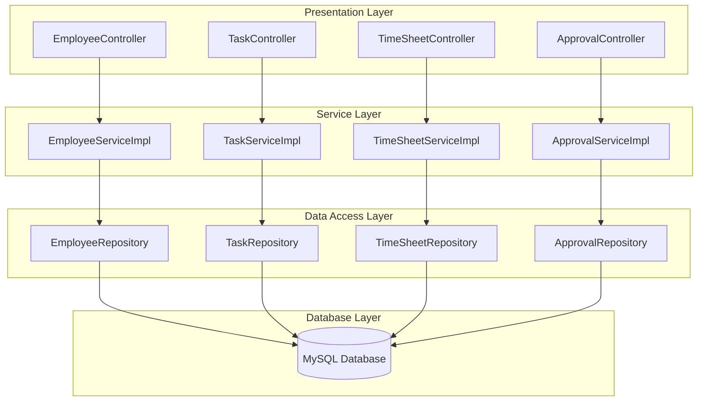

# [TIMESHEET MANAGEMENT]

**Course:** Modern Programming Practices  
**Block:** July 2025  
**Instructor:** Dr. Bright Gee Varghese R  

**Team Members:**  
- [Thanh Hai Nguyen] - [619562]  
- [Adisalem Hadush Shiferaw] - [Student ID]  

**Date of Submission:** [07/17/2025]  

---

## 1. Problem Description

Provide a clear and concise explanation of the real-world problem your project aims to solve.  
Include background, motivation, and significance of the problem.

---

## 2. User Stories

Describe the system from the user's perspective using user stories:

- As a **[user role]**, I want to **[feature]** so that **[benefit]**.  
- As a **[user role]**, I want to **[feature]** so that **[benefit]**.  
- ...

---

## 3. Functional Requirements

List the system's essential features and functionalities:

- [Feature 1 description]  
- [Feature 2 description]  
- [Feature 3 description]  
- ...

---

## 4.  Non-Functional Requirements

- Language: [Java, JavaScript]  
- Framework: [Spring Boot, React]  
- Database: [MySQL, MongoDB]  
- Tools: [Git, Postman]  

---

## 5. Architecture of Project

### 5.1 Overview

Our system follows a **4-layer N-tier architecture** using modern Java Spring Boot practices:

1. **Presentation Layer (Controller)**  
   - Exposes RESTful APIs for all business entities (Employee, Department, Project, Task, Timesheet, Approval, etc.).
   - Handles HTTP requests and responses, input validation, and error handling.
   - Example: `EmployeeController`, `TaskController`, etc.

2. **Service Layer**  
   - Contains business logic and orchestrates data flow between controllers and repositories.
   - Handles validation, calculations (e.g., total work hours), and business rules.
   - Example: `EmployeeServiceImpl`, `TaskServiceImpl`, etc.

3. **Data Access Layer (Repository/DAO)**  
   - Uses Spring Data JPA repositories to abstract and manage all database operations.
   - Provides CRUD and custom query methods for each entity.
   - Example: `EmployeeRepository`, `TaskRepository`, etc.

4. **Database Layer**  
   - MySQL database stores all persistent data, including employees, timesheets, tasks, approvals, and more.
   - Enforces referential integrity and supports transactional operations.

This separation ensures modularity, testability, and maintainability.

---

### 5.2 Architecture Diagram



---

### 5.3 Technologies Used

- **Java 21**
- **Spring Boot 3**
- **Spring Data JPA**
- **MySQL 8**
- **Maven**
- **JUnit & Mockito** (for unit testing)
- **Postman** (for API testing)
- **Git & GitHub**

---

### 5.4 Layer Descriptions

- **Presentation Layer:**  
  - Exposes REST APIs to clients (frontend or Postman).
  - Handles HTTP requests, input validation, and error responses.

- **Service Layer:**  
  - Implements business logic, validation, and calculations.
  - Coordinates between controllers and repositories.

- **Data Access Layer:**  
  - Uses Spring Data JPA for database CRUD operations.
  - Abstracts SQL and database details from the rest of the app.

- **Database Layer:**  
  - MySQL database with tables for Employee, Department, Project, Task, Timesheet, Approval, etc.
  - Enforces relationships and data integrity.

---

## 6. Use Case Diagram(s)  
  
*(Replace with actual diagram)*

---

## 7. Use Case Descriptions  

### Use Case Name: Submit Timesheet  
- **Primary Actor(s)**: Employee  
- **Preconditions**: User must be logged in and assigned to a project  
- **Postconditions**: A timesheet is recorded in the system  
- **Main Success Scenario**:  
  1. Employee logs in  
  2. Navigates to “Submit Timesheet”  
  3. Inputs working hours for each day  
  4. Submits the form  
  5. System stores the entry and displays confirmation  

---

## 8. Class Diagram  
  
*(Include Employee, Timesheet, Project, Account, Role, etc.)*

---

## 9. Sequence Diagrams  

### Example: Submit Timesheet  
  
*(Include controller -> service -> repository flow)*

---

## 10. Screenshots  

- **Login Page**  
  

- **Timesheet Submission Form**  
  

- **Admin Dashboard**  
  

---

## 11. Installation & Deployment  

### Step 1: Clone the Repository  
```bash
git clone https://github.com/your-username/timesheet-management.git
cd timesheet-management


```

