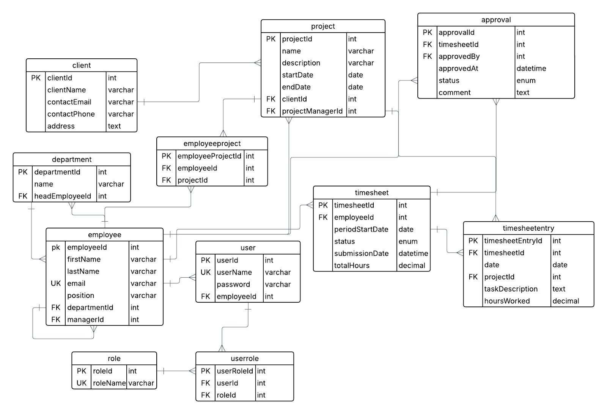
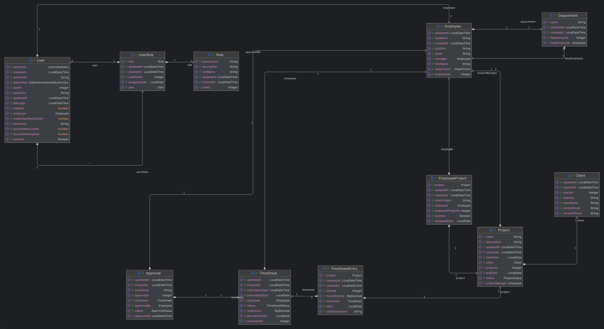

# [TIMESHEET MANAGEMENT]

**Course:** CS425 - Software Engineering 
**Block:** August 2025  
**Professor:** Obinna Kalu  

**Team Members:**  
- [Thanh Hai Nguyen] - [619562]  
- [Adisalem Hadush Shiferaw] - [619567]  

**Date of Submission:** [08/14/2025]  

---

## 1. Problem Description

Organizations often face challenges in tracking employee work hours, managing projects, and approving timesheets. Manual processes lead to errors, delays, and lack of transparency, affecting payroll accuracy, project monitoring, and overall productivity.
Managers often spend more time chasing employees for submissions and checking hours than focusing on important decisions. Meanwhile, employees deal with unclear and inconsistent processes for submitting and updating their timesheets.

Our Timesheet Management System addresses these problems by offering a single, easy-to-use platform where projects can be registered, clients and departments managed, timesheets recorded, and approvals handled quickly. This helps reduce errors, save time, and give everyone a clear view of work progress.

---

## 2. User Stories

Describe the system from the user's perspective using user stories:

- As an **[Admin]**, I want to **[register a new project]** so that it can be assigned to employees and tracked for timesheet purposes.

- As a **[Admin]**, I want to **[add client details]** so that projects can be linked to the correct client.

- As an **[Admin]**, I want to **[add a new department]** so that employees can be grouped and managed effectively.

- As a **[Employee]**, I want to  **[create a my account]** so that I  can log in and use the system.

- As a **[Admin, Manager, or Employee]**, I want to  **[create, edit,  update and submit my timesheet]** so that work hours and tasks are accurately recorded.

- As a **[Manager]**, I want to  **[review and approve submitted timesheets]** so that only verified work hours are recorded for payroll and reporting.

---

## 3. Architecture of Project

### 3.1 Overview

Our system follows a **4-layer N-tier architecture** using modern Java Spring Boot practices:

1. **Presentation Layer (Controller)**  
   - Exposes RESTful APIs for all business entities (Employee, Department, Project, Task, Timesheet, Approval, etc.).
   - Handles HTTP requests and responses, input validation, and error handling.
   - Example: `EmployeeController`, `TimeSheetController`, etc.

2. **Service Layer**  
   - Contains business logic and orchestrates data flow between controllers and repositories.
   - Handles validation, calculations (e.g., total work hours), and business rules.
   - Example: `EmployeeServiceImpl`, `TimeSheetServiceImpl`, etc.

3. **Data Access Layer (Repository/DAO)**  
   - Uses Spring Data JPA repositories to abstract and manage all database operations.
   - Provides CRUD and custom query methods for each entity.
   - Example: `EmployeeRepository`, `TimeSheetRepository`, etc.

4. **Database Layer**  
   - MySQL database stores all persistent data, including employees, timesheets, tasks, approvals, and more.
   - Enforces referential integrity and supports transactional operations.

This separation ensures modularity, testability, and maintainability.

---

### 3.2 Architecture Diagram

---

### 3.3 Technologies Used

- Language: [Java, JavaScript]  
- Framework: [Spring Boot, React, JUnit]  
- Database: [MySQL]  
- Tools: [Git, GitHub, Postman]  

---

### 3.4 Layer Descriptions

#### **🎯 Presentation Layer (Controllers)**
- **RESTful API Controllers**: 10 controllers handling HTTP requests and responses
  - `TimeSheetController` - Manages timesheet CRUD operations with role-based access
  - `TimeSheetEntryController` - Handles individual time entries within timesheets
  - `ApprovalController` - Manages approval workflow for timesheets
  - `EmployeeController` - Employee management operations
  - `DepartmentController` - Department CRUD operations
  - `ProjectController` - Project management functionality
  - `ClientController` - Client relationship management
  - `AuthController` - Authentication and authorization endpoints
  - `UserController` - User management operations
  - `GlobalExceptionHandler` - Centralized error handling and response formatting

- **Key Features**:
  - Role-based access control with `@PreAuthorize` annotations
  - Cross-origin resource sharing (CORS) configuration
  - Input validation and error handling
  - HTTP status code management
  - DTO-based request/response handling

#### **⚙️ Service Layer (Business Logic)**
- **Service Interfaces & Implementations**: 8 service modules with business logic
  - `TimeSheetService` - Timesheet business operations and validation
  - `TimeSheetEntryService` - Time entry calculations and rules
  - `ApprovalService` - Approval workflow logic
  - `EmployeeService` - Employee business operations
  - `DepartmentService` - Department management logic
  - `ProjectService` - Project lifecycle management
  - `ClientService` - Client relationship business logic
  - `UserService` - User authentication and management

- **Key Features**:
  - Business rule enforcement (e.g., daily hour limits, approval workflows)
  - Data transformation between DTOs and entities
  - Transaction management
  - Validation logic
  - Complex calculations (e.g., total work hours, period summaries)

#### **🗄️ Data Access Layer (Repositories)**
- **Spring Data JPA Repositories**: 11 repository interfaces for database operations
  - `TimeSheetRepository` - Timesheet CRUD with custom queries
  - `TimeSheetEntryRepository` - Time entry database operations
  - `ApprovalRepository` - Approval status tracking
  - `EmployeeRepository` - Employee data access
  - `DepartmentRepository` - Department persistence
  - `ProjectRepository` - Project data management
  - `ClientRepository` - Client data operations
  - `UserRepository` - User authentication data
  - `RoleRepository` - Role-based access control data
  - `UserRoleRepository` - User-role relationship management
  - `EmployeeProjectRepository` - Employee-project assignments

- **Key Features**:
  - Custom query methods for complex business requirements
  - Relationship management (e.g., employee-project assignments)
  - Spring Data JPA automatic query generation
  - Transactional data access

#### **🔐 Security Layer**
- **JWT Authentication & Authorization**:
  - `JwtTokenProvider` - JWT token generation and validation
  - `JwtAuthenticationFilter` - Request authentication filtering
  - `JwtAuthenticationEntryPoint` - Authentication error handling
  - `SecurityConfig` - Spring Security configuration
  - `CorsConfig` - Cross-origin request handling

#### **📊 Data Transfer Objects (DTOs)**
- **Request DTOs**: 9 DTOs for API input validation
  - `TimeSheetRequestDTO`, `TimeSheetWithEntriesRequestDTO`
  - `ApprovalRequestDTO`, `EmployeeRequestDTO`
  - `DepartmentRequestDTO`, `ProjectRequestDTO`
  - `ClientRequestDTO`, `UserRequestDTO`
  - `LoginRequestDTO`, `SignupRequestDTO`

- **Response DTOs**: 11 DTOs for API output formatting
  - `TimeSheetResponseDTO`, `TimeSheetDetailResponseDTO`, `TimeSheetEntryResponseDTO`
  - `ApprovalResponseDTO`, `EmployeeResponseDTO`
  - `DepartmentResponseDTO`, `ProjectResponseDTO`
  - `ClientResponseDTO`, `UserResponseDTO`
  - `JwtResponseDTO`, `MessageResponseDTO`

#### **🏗️ Configuration Layer**
- **Application Configuration**:
  - `DataInitializer` - Database seeding and initialization
  - `SecurityConfig` - Security and authentication setup
  - `CorsConfig` - Cross-origin resource sharing configuration

#### **🗄️ Database Layer**
- **MySQL Database**: 12 entity tables with relationships
  - Core entities: `Employee`, `Department`, `Project`, `Client`
  - Time tracking: `TimeSheet`, `TimeSheetEntry`
  - Workflow: `Approval`, `Task`
  - Authentication: `User`, `Role`, `UserRole`
  - Relationships: `EmployeeProject`
  - Audit fields: `createdAt`, `updatedAt` timestamps

- **Key Features**:
  - Referential integrity with foreign key constraints
  - Audit trail with automatic timestamp management
  - Enum-based status tracking (e.g., `TimeSheetStatus`, `ProjectStatus`)
  - Optimized indexes for performance

---

## 4. Use Case Diagram(s)  

---

## 5. ER Diagram  

## 6. Class Diagram

The class diagram below illustrates the complete data model of the TimeSheet Management System, showing all entities, their attributes, and relationships.

---

## 7. Sequence Diagrams

### 7.1 Create New Timesheet Sequence Diagram

The following sequence diagram illustrates the complete flow for creating a new timesheet in the system, including authentication, validation, and data persistence.

